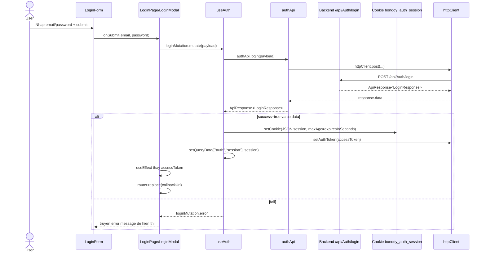

# Login Flow - Bonddy FE

## 1) Muc tieu

Tai lieu nay mo ta luong dang nhap hien tai cua project (as-is), bao gom:

- Dang nhap tu trang `/login`
- Dang nhap tu modal route `@modal/(.)login`
- Luu session vao cookie
- Dong bo token vao `httpClient`
- Redirect theo `callbackUrl`

## 2) Cac file chinh

- `src/app/(auth)/login/page.tsx`
- `src/app/@modal/(.)login/page.tsx`
- `src/app/(auth)/components/login-modal.tsx`
- `src/app/(auth)/components/login-form.tsx`
- `src/features/auth/hooks/useAuth.ts`
- `src/features/auth/api/services/auth.services.ts`
- `src/features/auth/type.ts`
- `src/lib/config/cookie.ts`
- `src/lib/http/client.ts`
- `src/lib/callback-url.ts`
- `src/app/layout.tsx`

## 3) Tong quan kien truc

- `LoginForm` chi lo UI va emit event `onSubmit(email, password)`.
- `LoginPage`/`LoginModal` dong vai tro container:
  - goi `useAuth()`
  - truyen handler vao form
  - theo doi `sessionQuery.data?.accessToken` de redirect.
- `useAuth` xu ly business logic:
  - doc session tu cookie
  - goi API login qua `authApi.login`
  - luu session vao cookie
  - set bearer token cho `httpClient`
  - quan ly session qua React Query.

## 4) Trinh tu luong dang nhap

## 5) Chi tiet theo tung lop

### 5.1 UI layer (`login-form.tsx`)

- Quan ly local state: `email`, `password`, `showPassword`.
- Khi submit form: goi `onSubmit?.(email, password)`.
- Hien thi loading qua `isLoading` va loi qua `error`.
- Khong chua logic API/cookie/token.

### 5.2 Container layer (`login/page.tsx`, `login-modal.tsx`)

- Lay `callbackUrl` tu query param va sanitize bang:
  - `normalizeCallbackUrl(sp.get("callbackUrl"), "/")`.
- Submit:
  - `loginMutation.mutate({ email, password })`.
- Redirect sau login thanh cong:
  - theo doi `sessionQuery.data?.accessToken`
  - `router.replace(callbackUrl)`.
- Dieu huong qua signup/forgot-password:
  - dung `buildAuthUrl(path, callbackUrl)` de giu callback.

### 5.3 Business layer (`useAuth.ts`)

- `sessionQuery` doc du lieu tu cookie (`readAuthSessionFromCookie`) va cache voi key `['auth','session']`.
- `loginMutation`:
  - goi `authApi.login(payload)`
  - neu thanh cong: ghi cookie, set token vao http client, cap nhat query cache.
- `logout()`:
  - xoa cookie
  - clear token
  - set query data ve `null`.
- Auto handle 401:
  - dang ky `httpClient.setOnUnauthorized(logout)`.

### 5.4 API layer (`auth.services.ts`)

- Goi endpoint:
  - `POST /api/Auth/login`
- Kieu du lieu:
  - request: `LoginRequest { email, password }`
  - response: `ApiResponse<LoginResponse>`.

### 5.5 HTTP + token layer (`http/client.ts`)

- Request interceptor:
  - Neu co token trong `authTokenStore` -> add header `Authorization: Bearer <token>`.
- Response interceptor:
  - Normalize error thanh `ApiError`.
  - Neu status 401:
    - clear token
    - goi callback `onUnauthorized` (dang tro toi `logout`).

### 5.6 Cookie layer (`cookie.ts`)

- Session cookie name: `bonddy_auth_session`.
- Gia tri cookie la toan bo object `LoginResponse` duoc `JSON.stringify`.
- `maxAge` lay tu `expiresInSeconds` cua backend.
- `sameSite=lax`, `secure` khi production.

## 6) Callback URL va bao mat redirect

`normalizeCallbackUrl` dang chan cac truong hop:

- URL khong bat dau bang `/` (chan external URL).
- Protocol-relative URL: `//...`.
- Vong lap auth route: `/login`, `/signup`, `/forgot-password`.

Muc tieu la tranh open-redirect va tranh login xong quay lai auth page.

## 7) Modal login flow

- Root layout render ca `children` va `modal`, nen co the hien login dang overlay.
- Route `src/app/@modal/(.)login/page.tsx` chi wrap `LoginModal`.
- Dong modal bang `router.back()`.
- Business flow login trong modal giong trang `/login`.

## 8) Du lieu session dang duoc luu

Theo `LoginResponse`, session dang luu:

- `accessToken`
- `refreshToken`
- `email`
- `fullName`
- `role`
- `expiresInSeconds`
- `tokenType`

## 9) Ket luan

Luong login hien tai da tach 3 lop ro rang:

- UI (`LoginForm`)
- Container (`LoginPage`/`LoginModal`)
- Business + infrastructure (`useAuth`, `authApi`, `httpClient`, cookie)

Uu diem:

- Tai su dung duoc giua page va modal
- Dong bo session/token tu cookie -> React Query -> HTTP client
- Co sanitize `callbackUrl`

Luu y:

- Session luu client-side cookie dang o dang JSON thuong (khong HttpOnly), can can nhac chinh sach bao mat phu hop voi kien truc backend.
